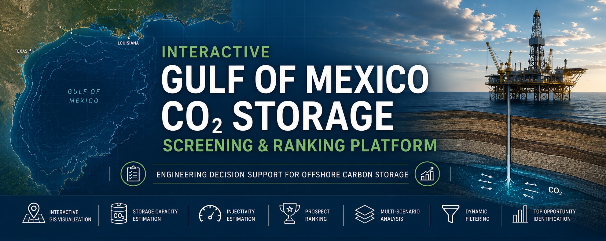
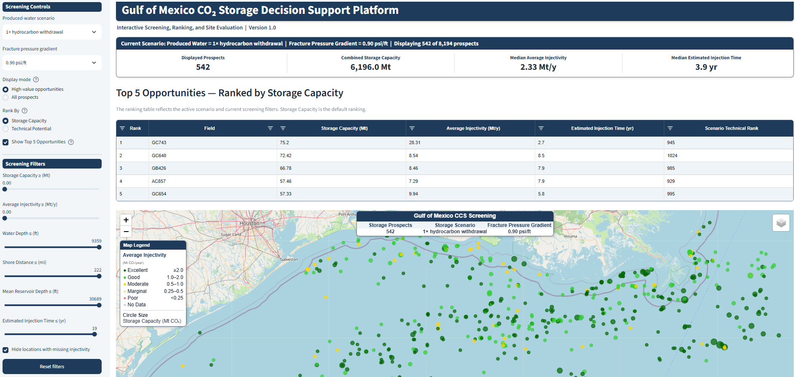

# Gulf of Mexico CO₂ Storage Decision Support Platform



### Interactive Engineering Decision-Support Platform for Screening, Ranking, And Evaluating Offshore CO₂ Storage Opportunities Using Publicly Available BOEM Reservoir Data

---

## Overview

The **Gulf of Mexico CO₂ Storage Decision Support Platform** is an interactive engineering application developed to rapidly evaluate offshore CO₂ storage opportunities using publicly available **U.S. Bureau of Ocean Energy Management (BOEM)** reservoir data.

The platform integrates engineering calculations, prospect ranking, and GIS visualization into a single decision-support environment that enables rapid screening of thousands of offshore sandstone reservoirs under multiple engineering scenarios.

Designed for reservoir engineers, geologists, and carbon storage professionals, the platform provides an intuitive workflow for comparing storage opportunities during early-stage site screening.

---
## 🌐 Live Application

[Launch the Interactive GoM CO₂ Storage Screening and Ranking Platform](https://gom-co2-storage.streamlit.app/)

---

## Main Dashboard



---

## Key Engineering Capabilities

- Interactive GIS visualization of Gulf of Mexico storage prospects
- Engineering-based CO₂ storage capacity estimation
- Average injectivity estimation under multiple fracture pressure scenarios
- Twelve pre-computed engineering scenarios for rapid comparison
- Dynamic Storage Capacity and Technical Potential rankings
- Interactive engineering filters
- Top-5 prospect ranking
- Detailed engineering information through interactive map popups
- High-performance visualization using pre-processed datasets

---

## Engineering Workflow

```text
BOEM Gulf of Mexico Atlas
            │
            ▼
Data Quality Assessment
            │
            ▼
Engineering Calculations
(Storage Capacity & Injectivity)
            │
            ▼
Scenario Generation
(12 Engineering Cases)
            │
            ▼
Prospect Ranking
            │
            ▼
Interactive Decision Support Platform
```

---

## Engineering Methodology

The platform follows a practical engineering workflow:

1. Import and validate BOEM reservoir data.
2. Estimate CO₂ storage capacity using engineering correlations.
3. Estimate average injectivity under multiple operating scenarios.
4. Rank storage opportunities using engineering performance metrics.
5. Generate multiple engineering screening scenarios.
6. Visualize, compare, and filter prospects through an interactive dashboard.

This platform is intended for engineering screening and comparative evaluation. Final storage site selection should always be supported by detailed geological characterization and reservoir simulation.

---

## Data Source

**U.S. Bureau of Ocean Energy Management (BOEM)**

Dataset:

**2023 Gulf of Mexico Atlas Update**

https://www.data.boem.gov/Main/GandG.aspx

---

## Data Availability

The processed engineering dataset and application source code are **not included** in this repository.

Because BOEM periodically updates the Gulf of Mexico Atlas, interested users are encouraged to obtain the latest BOEM data directly from the official source.

Questions regarding the engineering workflow, methodology, or potential collaboration are welcome.

---

## Live Demonstration

**Interactive Streamlit Application**

*(Streamlit application link will be added after deployment.)*

---

## About the Author

**Dr. Muhammad Zulqarnain** is a **Petroleum Engineer and IBM-Certified Data Scientist** with over 15 years of experience in subsurface energy systems and more than a decade specializing in carbon capture and geological storage (CCS). His expertise spans reservoir simulation, geomechanics, Class VI well permitting, and the application of data science and machine learning to practical reservoir engineering and subsurface energy challenges. He holds IBM Professional Certificates in both **Data Science** and **Machine Learning**.

**Google Scholar**

https://scholar.google.com/citations?user=Z2f-xHkAAAAJ&hl=en

**LinkedIn**

https://www.linkedin.com/in/muhammadzulqarnain

**GitHub**

https://github.com/mzulqa1

---

## Collaboration

The implementation, engineering workflow, and processed datasets are maintained privately.

If you are interested in:

- engineering collaboration,
- research opportunities,
- methodology discussions,
- consulting,
- or adapting the platform to other offshore basins,

please feel free to connect through LinkedIn or GitHub.

---

## Disclaimer

This platform is intended for engineering screening, education, and research purposes only. Results should not be interpreted as detailed storage site evaluations and should always be supplemented with site-specific geological characterization and reservoir simulation.
